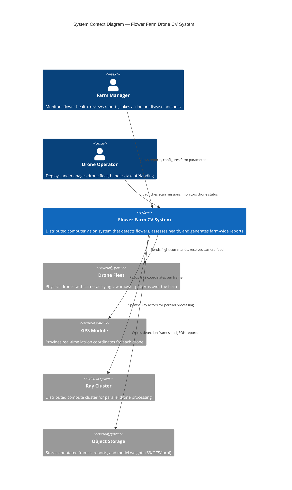
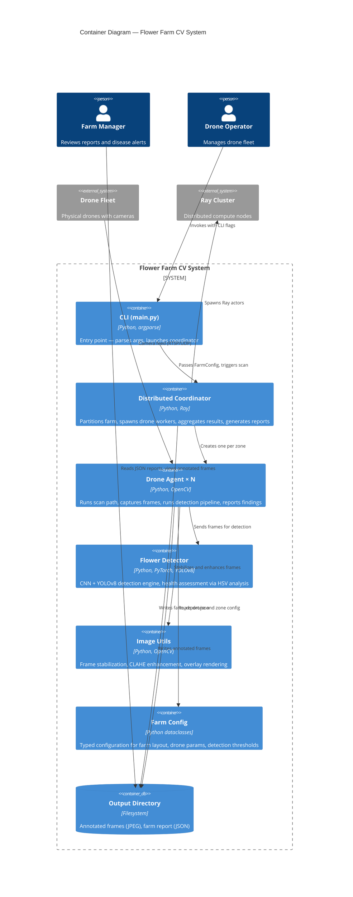
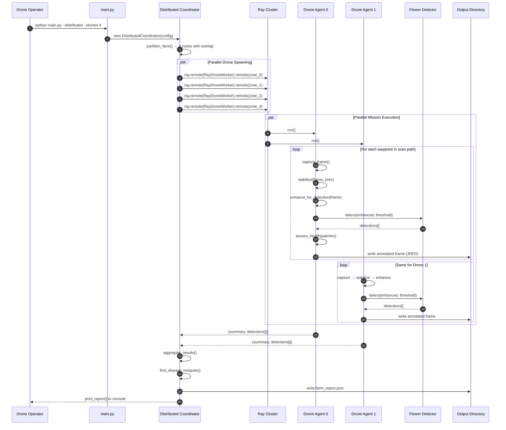
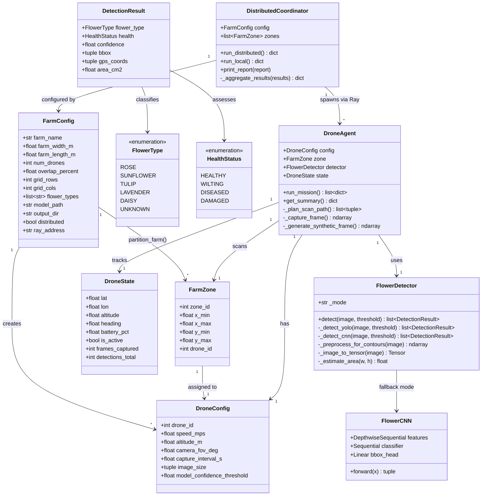
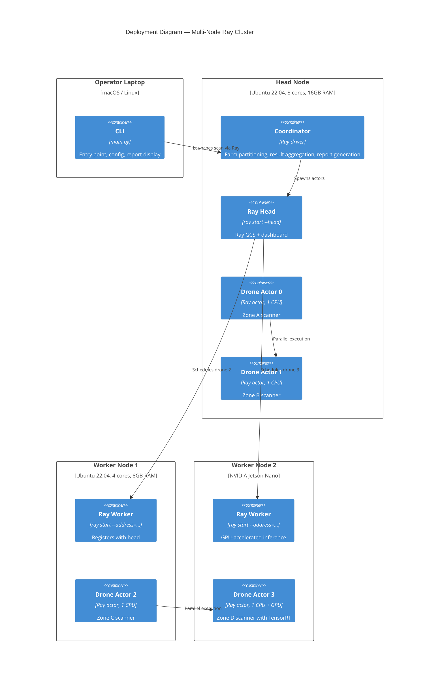
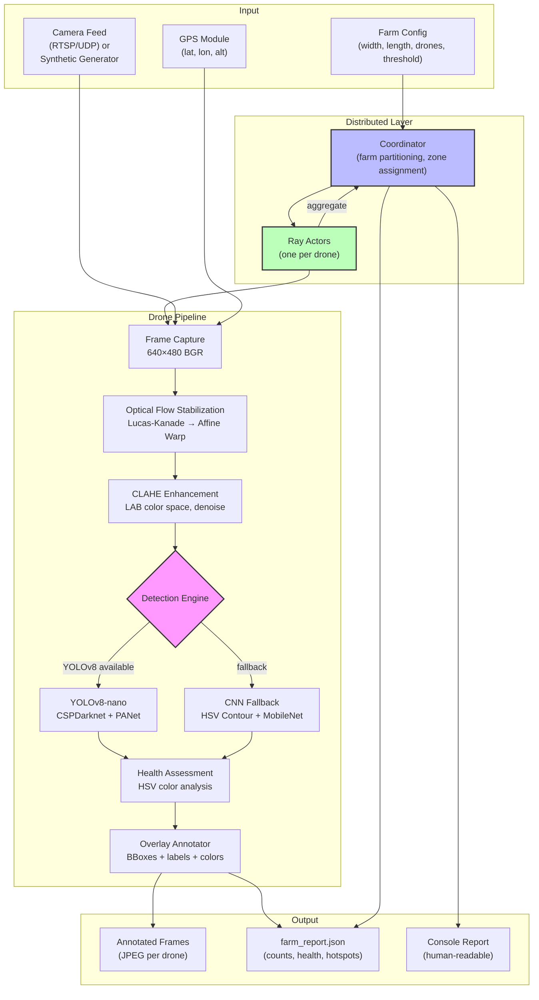
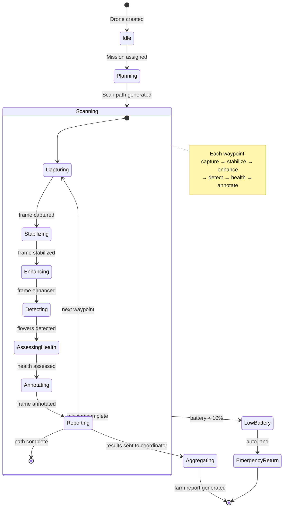

# Flower Farm Drone CV System — Diagrams

## System Context (C4 Level 1)

Who uses the system and what does it interact with?



## Container Diagram (C4 Level 2)

What are the major running parts?



## Component Diagram (C4 Level 3)

How does the Drone Agent's detection pipeline work internally?

```mermaid
C4Component
    title Component Diagram — Drone Agent Detection Pipeline

    Container_Boundary(agent, "Drone Agent") {
        Component(path_planner, "Scan Path Planner", "numpy", "Generates boustrophedon (lawnmower) waypoints from zone bounds and camera FOV")
        Component(frame_capture, "Frame Capture", "cv2 / simulation", "Captures frame from RTSP stream or generates synthetic flowers")
        Component(stabilizer, "Frame Stabilizer", "cv2, Lucas-Kanade", "Optical flow tracking → affine warp to compensate drone jitter")
        Component(enhancer, "CLAHE Enhancer", "cv2, LAB color space", "Adaptive histogram equalization on L channel, denoising")
        Component(yolo_detector, "YOLOv8 Detector", "ultralytics, PyTorch", "Object detection backbone — CSPDarknet + PANet + decoupled head")
        Component(cnn_detector, "CNN Fallback Detector", "PyTorch, depthwise-separable", "HSV contour isolation + MobileNet-style classification")
        Component(health_assessor, "Health Assessor", "numpy, HSV analysis", "Color distribution analysis → healthy/wilting/diseased/damaged")
        Component(annotator, "Overlay Annotator", "cv2", "Draws bounding boxes, labels, and health colors on frames")
        Component(reporter, "Mission Reporter", "dataclass", "Collects all detections, builds per-drone summary")
    }

    Rel(path_planner, frame_capture, "Provides (lat, lon) waypoints")
    Rel(frame_capture, stabilizer, "Raw frame")
    Rel(stabilizer, enhancer, "Stabilized frame")
    Rel(enhancer, yolo_detector, "Enhanced frame")
    Enhancer-->cnn_detector: "Fallback if YOLO unavailable"
    Rel(yolo_detector, health_assessor, "Detected flower patches")
    Rel(cnn_detector, health_assessor, "Detected flower patches")
    Rel(yolo_detector, annotator, "Bounding boxes + labels")
    Rel(health_assessor, annotator, "Health status per detection")
    Rel(annotator, reporter, "Annotated detections")
```

## Dynamic Diagram (C4 Level 4)

What's the runtime sequence of a farm scan?



## Class Diagram

What are the core data structures and their relationships?



## Deployment Diagram

How does this deploy across machines?



## Data Flow Diagram

How does data move through the system?



## State Diagram

Drone lifecycle during a mission.



## Gitgraph — Development Flow

```mermaid
gitgraph
    commit id: "init" tag: "v0.1"
    commit id: "farm_config"
    commit id: "flower_detector"
    branch feature/distributed
    commit id: "ray_coordinator"
    commit id: "drone_agent"
    commit id: "image_utils"
    checkout main
    merge feature/distributed id: "merge_distributed" tag: "v0.5"
    commit id: "cli_main"
    commit id: "simulation_mode"
    commit id: "readme_enriched" tag: "v1.0"
    commit id: "diagrams" tag: "v1.1"
```